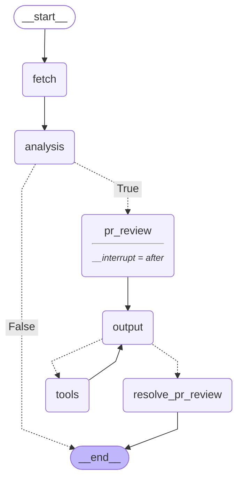
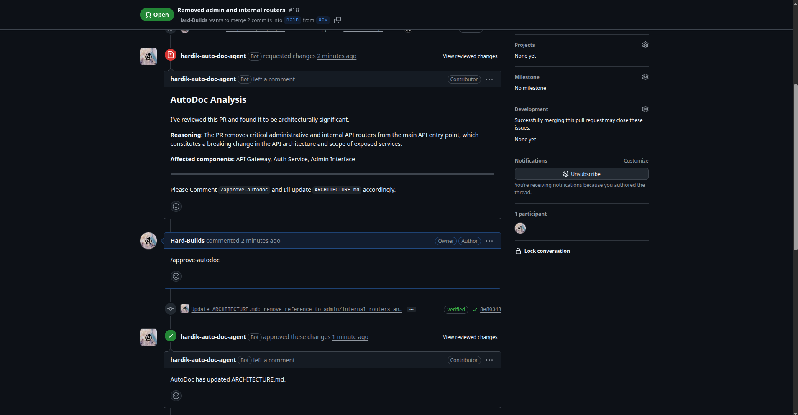

# AutoDoc Agent

An agentic GitHub PR reviewer built with **LangGraph**, **MCP (Model Context Protocol)**, and **Gemini** — designed as a learning project to explore **Human-in-the-Loop (HITL)** workflows and MCP-based tool integration.

## What it does

AutoDoc Agent monitors pull requests and automatically:

1. Fetches the PR diff via the GitHub MCP server
2. Analyses whether the changes are architecturally significant using Gemini
3. If significant — posts a `REQUEST_CHANGES` review on the PR asking for human approval
4. Waits for a human to comment `/approve-autodoc` (HITL step)
5. Reads `ARCHITECTURE.md` from the target branch, updates it to reflect the architectural changes, and writes it back
6. Approves and dismisses the original review once the doc is updated

## Learning goals

- **HITL with LangGraph** — using `interrupt_after` to pause the graph and resume on human input via the GitHub webhook trigger
- **MCP integration** — connecting to the GitHub MCP server to perform real GitHub operations (read PR diff, post reviews, read/write files) without custom API wrappers

## Agent graph

## Sample output

The agent posts an analysis review on the PR, waits for `/approve-autodoc`, updates `ARCHITECTURE.md`, then approves and closes out the review:

